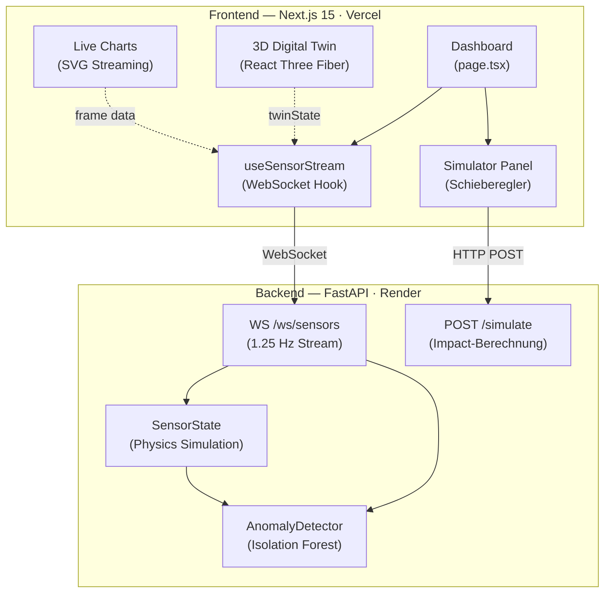

# AERO-SENSE — Predictive Maintenance & Live Process Twin

Echtzeit-Dashboard für eine simulierte CNC-Fertigungslinie mit 3D Digital Twin, ML-Anomalie-Erkennung und Was-wäre-wenn-Simulator.

---

## Architektur



## Tech-Stack

| Schicht | Technologie |
|---|---|
| Framework | Next.js 15 (App Router) |
| 3D | React Three Fiber + Drei |
| Animationen | Framer Motion |
| Styling | Tailwind CSS v4 + Glassmorphism |
| State | Zustand + React hooks |
| Backend | FastAPI + uvicorn |
| ML | scikit-learn (Isolation Forest) |
| Contracts | icontract (Laufzeit-Preconditions) |
| Tests | pytest + Hypothesis (property-based) |
| Container | Docker + Docker Compose |

---

## Schnellstart

### Option A — Docker Compose (empfohlen)

```bash
git clone https://github.com/dein-name/aero-sense.git
cd aero-sense
docker compose up --build
```

Öffne **http://localhost:3000**

### Option B — Lokal ohne Docker

**Backend:**
```bash
cd backend
pip install -r requirements.txt
uvicorn main:app --reload --port 8000
```

**Frontend:**
```bash
npm install
npm run dev
```

---

## Environment-Variablen

Kopiere `.env.example` nach `.env.local`:

```bash
cp .env.example .env.local
```

| Variable | Standard | Beschreibung |
|---|---|---|
| `NEXT_PUBLIC_API_URL` | `http://localhost:8000` | Backend REST-URL |
| `NEXT_PUBLIC_WS_URL` | `ws://localhost:8000` | Backend WebSocket-URL |
| `CORS_ORIGINS` | `http://localhost:3000` | Erlaubte CORS-Origins |
| `ML_CONTAMINATION` | `0.05` | Isolation Forest Kontaminationsrate |

---

## Tests

```bash
cd backend
pytest tests/ -v
```

**Hypothesis** (property-based): prüft mathematische Invarianten mit automatisch generierten Eingaben — z.B. dass `clamp()` immer in Bounds bleibt, Sensor-Werte nach 500 Ticks nie außerhalb definierter Grenzen liegen.

**icontract**: Laufzeit-Contracts als `@require`/`@ensure`-Decorators — feuern sowohl in Tests als auch in Produktion bei ungültigen Inputs.

---

## Features

- **Live Digital Twin** — 3D CNC-Maschine, Bauteile leuchten grün/gelb/rot je nach Sensor-Status
- **Predictive Alerts** — Remaining Useful Life (RUL) als Echtzeit-Gauge
- **ML-Anomalie-Erkennung** — Isolation Forest, trainiert auf synthetischen Normaldaten
- **Was-wäre-wenn-Simulator** — Schieberegler für Drehzahl, Kühlmittel, Vorschub → sofortige Impact-Vorschau
- **Prozess-Heatmap** — farbcodierte Engpass-Visualisierung nach Stationen

---

## Deployment

**Frontend → Vercel:**
```bash
vercel deploy
# Env-Vars in Vercel-Dashboard setzen:
# NEXT_PUBLIC_API_URL=https://dein-backend.render.com
# NEXT_PUBLIC_WS_URL=wss://dein-backend.render.com
```

**Backend → Render:**
- New Web Service → Docker
- Root: `./backend`
- Port: `8000`
- Env-Var: `CORS_ORIGINS=https://dein-frontend.vercel.app`
