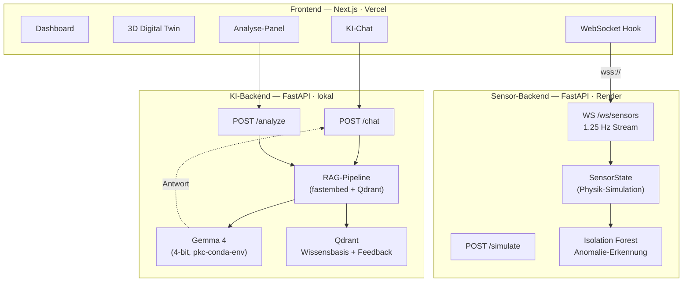

# AERO-SENSE — Predictive Maintenance & Live Process Twin

Echtzeit-Dashboard für eine simulierte CNC-Fertigungslinie mit 3D Digital Twin, ML-Anomalie-Erkennung, RAG-Wartungsassistent (Gemma 4 + Qdrant) und KI-Chat.

**Live-Demo:** https://aero-sense-ashy.vercel.app  
**GitHub:** https://github.com/fatihaltiok/aero-sense

---

## Features

| Feature | Beschreibung |
|---|---|
| **Live Digital Twin** | 3D CNC-Maschine (React Three Fiber), Bauteile leuchten grün/gelb/rot je nach Sensor-Status, Anomalie-Partikeleffekt |
| **Echtzeit-KPI-Cards** | RPM, Temperatur, Vibration, Energie — Spring-animiert via WebSocket |
| **ML-Anomalie-Erkennung** | Isolation Forest, trainiert auf 2.000 synthetischen Normaldatenpunkten |
| **RUL-Gauge** | Remaining Useful Life als SVG-Kreisbogen, Farbe wechselt bei kritischen Werten |
| **Live-Chart** | Zeitreihen für Vibration, Temperatur, Energie — umschaltbar |
| **Was-wäre-wenn-Simulator** | Schieberegler RPM/Kühlmittel/Vorschub → sofortige Impact-Berechnung |
| **Prozess-Heatmap** | Engpass-Visualisierung nach Stationen und Metriken |
| **RAG-Wartungsassistent** | Gemma 4 + Qdrant: Anomalie → Ursachenanalyse → Reparaturplan |
| **KI-Chat** | Konversation mit Gemma 4 mit Echtzeit-Maschinenzustand als Kontext |
| **Mechaniker-Feedback** | Reparaturbestätigung oder Korrektur → wird in Qdrant gespeichert |

---

## Architektur



---

## Tech-Stack

| Schicht | Technologie |
|---|---|
| Framework | Next.js 15 (App Router) |
| 3D | React Three Fiber + Drei |
| Animationen | Framer Motion |
| Styling | Tailwind CSS v4 + Glassmorphism |
| Backend | FastAPI + uvicorn |
| Sensor-Simulation | Python (Physik-Modell + Gauss-Rauschen) |
| ML-Anomalie | scikit-learn Isolation Forest |
| LLM | Gemma 4 E4B (4-bit quantisiert, lokal) |
| Embedding | fastembed (all-MiniLM-L6-v2) |
| Vektordatenbank | Qdrant |
| Contracts | icontract (Laufzeit-Preconditions) |
| Tests | pytest + Hypothesis (property-based, 34 Tests) |
| Container | Docker + Docker Compose |
| Deployment | Vercel (Frontend) + Render (Sensor-Backend) |

---

## Schnellstart

### Option A — Docker Compose (empfohlen)

```bash
git clone https://github.com/fatihaltiok/aero-sense.git
cd aero-sense
docker compose up --build
```

Öffne **http://localhost:3000**

> **Hinweis:** Docker startet nur Sensor-Backend + Frontend.  
> Für KI-Chat und Analyse wird das lokale Setup (Option B) benötigt.

### Option B — Lokal (vollständig mit KI)

**Voraussetzungen:**
- Qdrant läuft auf `localhost:6333`
- Gemma 4 im conda-env `pkc` installiert (`google/gemma-4-E4B-it`)

**Backend:**
```bash
cd backend
pip install -r requirements.txt
uvicorn main:app --reload --port 8000
```

**Frontend:**
```bash
npm install
npm run dev
```

Öffne **http://localhost:3000**

---

## Seiten

| URL | Inhalt |
|---|---|
| `/` | Haupt-Dashboard (KPIs, Charts, Heatmap, Simulator, Analyse) |
| `/twin` | Vollbild 3D Digital Twin |
| `/chat` | KI-Chat mit Gemma 4 |

---

## KI-Wartungsassistent

### Wie es funktioniert

```
Anomalie erkannt
      ↓
1. Sensor-Kontext → Embedding (fastembed)
      ↓
2. Qdrant-Abfrage → ähnliche Fehler + Wartungsintervalle + Mechaniker-Korrekturen
      ↓
3. Gemma 4 (lokal, 4-bit) → strukturierter Reparaturplan
      ↓
4. Mechaniker erhält: Ursache + Sofortmaßnahmen + Schritte + Ersatzteile + Zeitschätzung
      ↓
5a. Bestätigt → als "verifiziert" in Qdrant gespeichert
5b. Korrektur → Mechaniker-Bericht → in Qdrant → verbessert nächste Analyse
```

### Wissensbasis (Qdrant: `aero_sense_knowledge`)

- 7 Fehler-Ursachen-Bäume (Vibration, Temperatur, RUL, Kombifehler, Energie)
- 5 Wartungsintervalle (Spindellager, Kühlmittel, Hauptlager, Keilriemen, Filter)
- Mechaniker-Korrekturen wachsen mit jeder Reparatur

---

## Tests

```bash
cd backend
pytest tests/ -v
```

**34 Tests — alle grün**

- **Hypothesis** (property-based): `clamp()` Bounds, Status-Ableitungen, `compute_impact()` in `[0,1]`, Sensor-Werte nach 500 Ticks, Monotonie-Eigenschaften
- **icontract** (Laufzeit-Contracts): `@require`/`@ensure` feuern bei ungültigen Inputs in Tests und Produktion

---

## Environment-Variablen

Kopiere `.env.example` nach `.env.local`:

```bash
cp .env.example .env.local
```

| Variable | Standard | Beschreibung |
|---|---|---|
| `NEXT_PUBLIC_API_URL` | `http://localhost:8000` | Backend REST-URL |
| `NEXT_PUBLIC_WS_URL` | `ws://localhost:8000` | Backend WebSocket-URL |
| `CORS_ORIGINS` | `http://localhost:3000` | Erlaubte CORS-Origins |
| `ML_CONTAMINATION` | `0.05` | Isolation Forest Kontaminationsrate |

---

## Deployment

**Frontend → Vercel** (automatisch bei jedem Push auf `main`):
```bash
vercel deploy --prod
```

**Sensor-Backend → Render** (Docker, `render.yaml` vorhanden):
- New Blueprint → `fatihaltiok/aero-sense` → automatische Erkennung
- Env-Var: `CORS_ORIGINS=https://aero-sense-ashy.vercel.app`

**KI-Backend (Gemma 4 + Qdrant):**  
Läuft ausschließlich lokal — GPU mit min. 6 GB VRAM empfohlen.

---

## Projektstruktur

```
aero-sense/
├── backend/
│   ├── main.py              — FastAPI: WebSocket, Simulator, Analyse, Chat
│   ├── sensors.py           — Sensor-Simulation + icontract-Contracts
│   ├── ml.py                — Isolation Forest Anomalie-Erkennung
│   ├── rag.py               — RAG-Pipeline: Embedding + Qdrant + Gemma 4
│   ├── chat.py              — Chat-Modul: Gesprächsverlauf + Kontext
│   ├── knowledge_base.py    — Initiale Wissensbasis (Fehler-Bäume, Wartung)
│   └── tests/
│       ├── test_sensors_hypothesis.py
│       └── test_contracts.py
├── src/
│   ├── app/
│   │   ├── page.tsx         — Haupt-Dashboard
│   │   ├── twin/page.tsx    — 3D Digital Twin Vollbild
│   │   └── chat/page.tsx    — KI-Chat Vollbild
│   ├── components/dashboard/
│   │   ├── DigitalTwin.tsx
│   │   ├── KpiCard.tsx
│   │   ├── LiveChart.tsx
│   │   ├── AlertFeed.tsx
│   │   ├── RulGauge.tsx
│   │   ├── SimulatorPanel.tsx
│   │   ├── AnalysisPanel.tsx
│   │   └── ChatPanel.tsx
│   └── hooks/
│       └── useSensorStream.ts
├── docker-compose.yml
├── Dockerfile.frontend
├── render.yaml
└── PROJEKTBERICHT.md
```

---

*Fatih Altiok · fatihaltiok@outlook.com*
